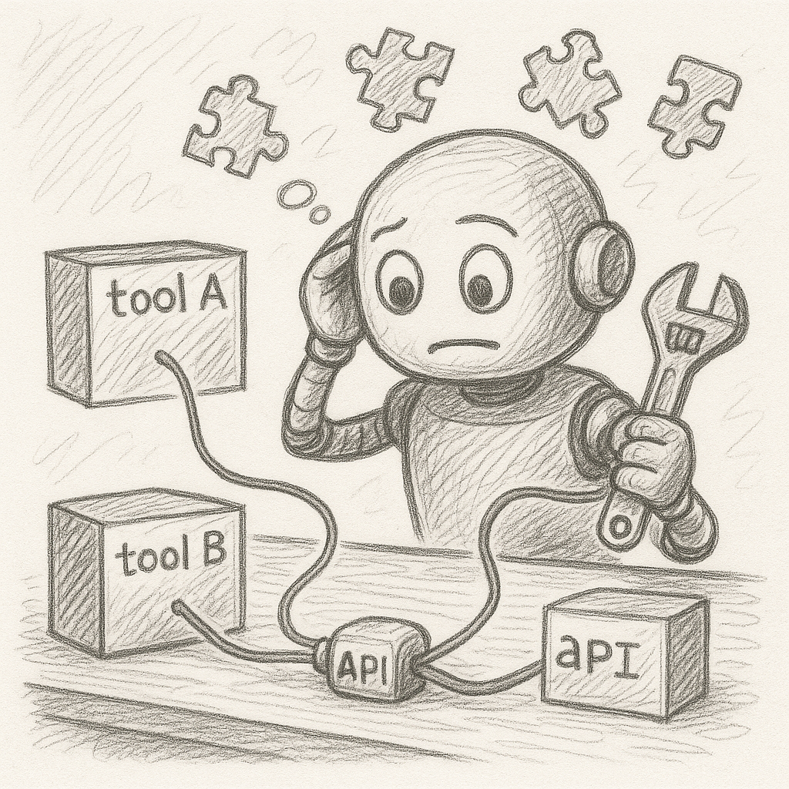

<div style="border: 2px solid #ccc; border-radius: 10px; padding: 10px 15px; background-color: #f9f9f9;">

<table>
<tr>
<td style="width: 200px; text-align: center; vertical-align: middle;">
  
</td>
<td style="text-align: left; vertical-align: middle;">
  <h1>Lab 02 — Agent with Tools</h1>
  <em>Teach an agent to call **Python functions** (tools) via function-calling.</em>
</td>
</tr>
</table>

</div>

**What you’ll learn**
- Declaring tools with **names, descriptions, and JSON schemas**
- Attaching Python implementations to tools
- Letting the model decide **when** to call which tool

**Run**
```bash
**Windows**
python 02_agent_with_tool.py

**Linux / macOS***
python3 02_agent_with_tool.py