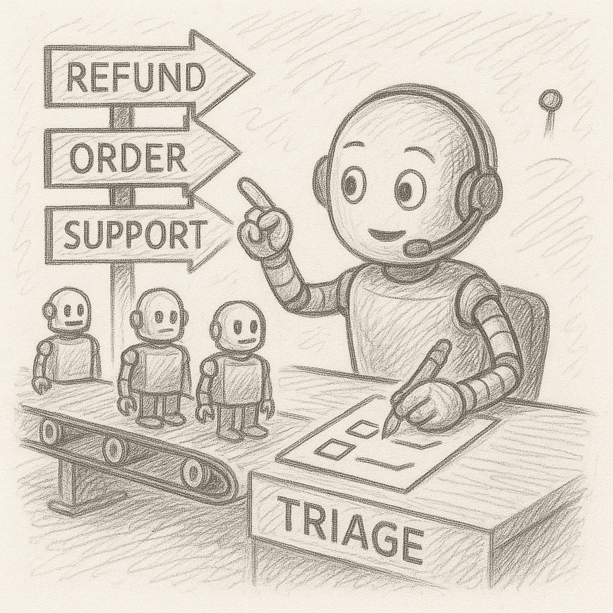

<div align="center" style="border: 2px solid #ccc; border-radius: 10px; padding: 10px 15px; background-color: #f9f9f9;">

<table>
<tr>
<td style="width: 200px; text-align: center; vertical-align: middle;">
  
</td>
<td style="text-align: left; vertical-align: middle;">
  <h1>Lab 03 — Multi‑Agent Handoff</h1>
  <em>Orchestrate a **triage agent** that routes to specialist agents (refund, order, support).</em>
</td>
</tr>
</table>

</div>

**What you’ll learn**
- Creating multiple `ChatAgent` instances with unique **roles**
- Building a **handoff workflow** with a coordinator
- Driving a request/response loop with an explicit **termination condition**

**Run**
```bash
**Windows**
python 03_multi_agent_handoff.py

**Linux / macOS***
python3 03_multi_agent_handoff.py